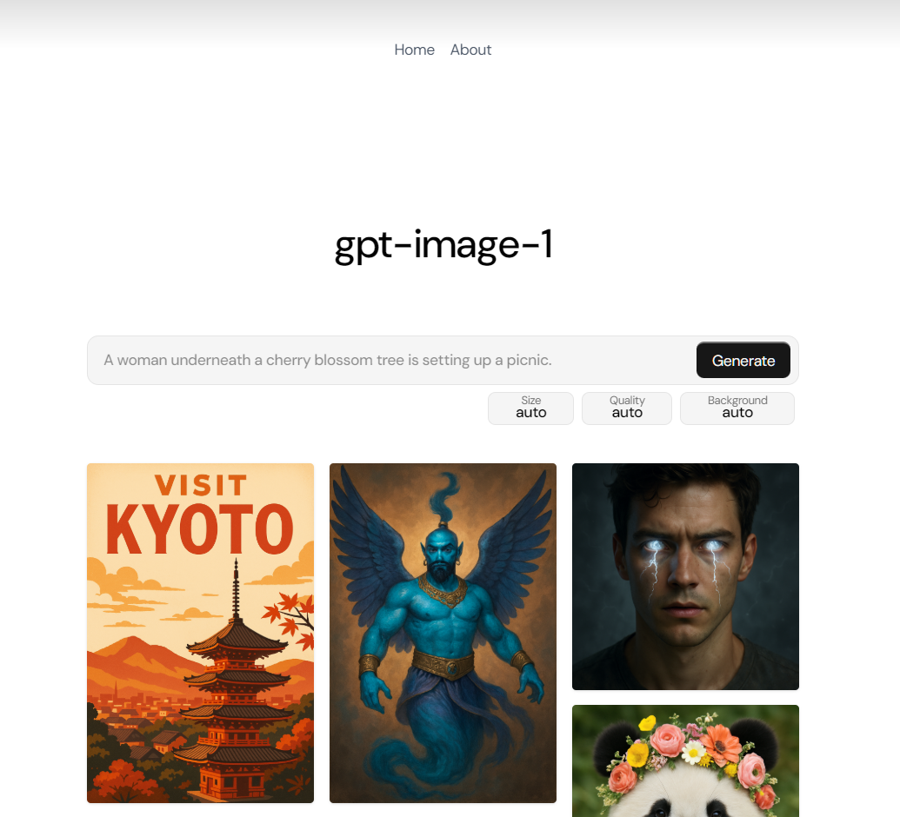

# GPT Image 1
OpenAI [has introduced their latest image generation model in the API](https://openai.com/index/image-generation-api/). I created a GUI to locally run the model to generate the images.

## Getting Started

1. **Install Node.js**
    Make sure you have [Node.js](https://nodejs.org/) installed on your system.

2. **Install Dependencies**
    Run the following command to install all dependencies:
    ```bash
    npm install
    ```

3. **Configure Environment Variables**
    - Rename the file `.env.example` to `.env`.
    - Open `.env` and set your OpenAI API key and other required variables.

4. **Start the Development Server**
    Run:
    ```bash
    npm run dev
    ```

5. **Generate Images**
    Use the application to generate images with the new gpt-image-1 model.

---

**Note:**
You must have a valid OpenAI API key to use this project.
